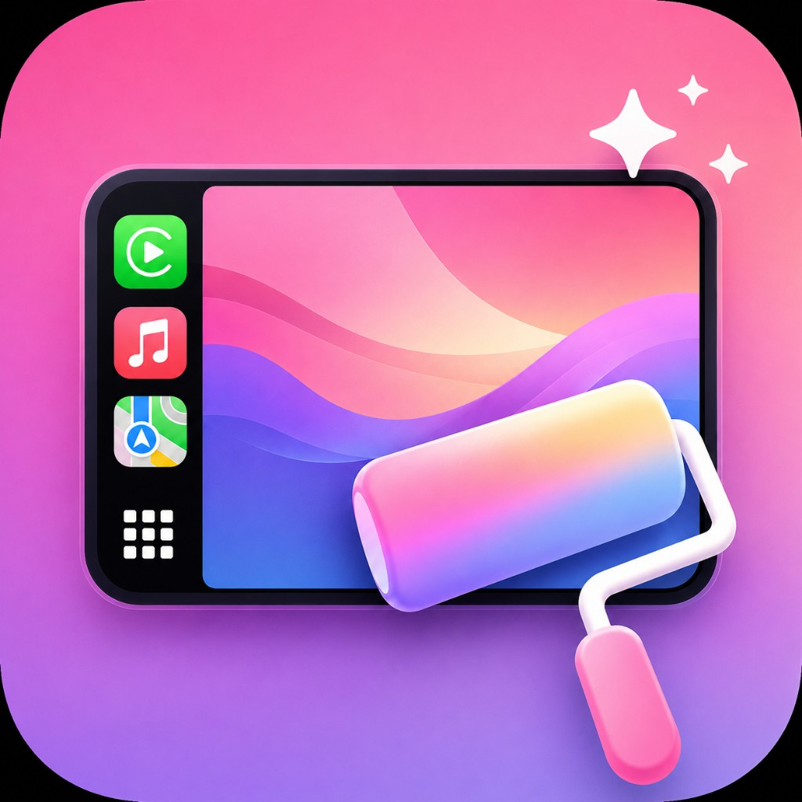
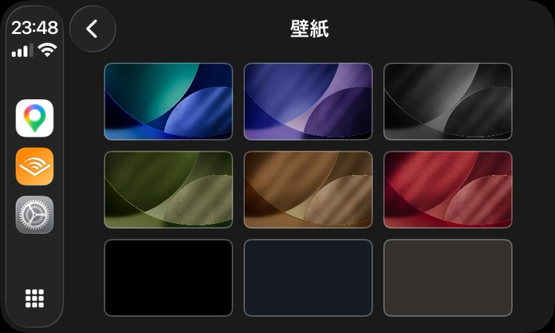

  

<h1 align="center">CarCanvas</h1>

  <a href="README.ja.md">日本語版はこちら</a>

Overwrite CarPlay wallpaper caches with your own images.

CarPlay loads wallpaper from pre-built cache files at launch. CarCanvas lets you create CPBitmap files and replace those caches.

## Requirements

- iPhone with **iOS 15+**
- A paired **CarPlay** system (to create wallpaper caches first)
- Ability to install an IPA signed with an **Enterprise / In-House** certificate  
  (normal App Store / personal / AltStore installs will not work)

## Features

- Create local CPBitmap wallpapers from photos
- History of exports with previews
- Overwrite CarPlay wallpaper cache files (Dark / Light selectable)
- Browse and manage CarPlay wallpaper cache files in-app
- Built-in setup guide

## Installation

CarCanvas **cannot be installed the normal way**.

It relies on the `com.apple.mobile.MobileHouseArrest` identity to access another app’s container (CarPlayWallpaper). These methods will **not** work:

- App Store
- Personal / development certificates via Xcode
- **AltStore** (including paid AltStore-style certificates)

You must **sign the IPA with an Enterprise / In-House certificate**, then install it.  
An unsigned IPA, or one re-signed for AltStore, will not get the required identity/permissions.

Apps such as **ESign** can help with enterprise signing for free. Exact steps vary by tool and environment — **please look them up yourself**. This README does not cover detailed install instructions.

Once CarCanvas is installed, you can change CarPlay wallpapers freely.

## Credits

This project is based on the source and research of [0xjohnnydev/FilzaSlop](https://github.com/0xjohnnydev/FilzaSlop). Without FilzaSlop’s MobileHouseArrest container access and related work, CarCanvas’s CarPlayWallpaper cache operations would not exist. Thank you.

> Special thanks to 0xjohnny for FilzaSlop and related research:  
> https://github.com/0xjohnnydev/FilzaSlop

FilzaSlop is a FilzaJailedDS-family fork that provides app-data container access and more. CarCanvas IPAs likewise assume the `com.apple.mobile.MobileHouseArrest` identity.

## How it works

CarPlay does not regenerate wallpapers from scratch every time. At launch it reads **pre-created cache files**.

Typical flow:

1. On CarPlay, select wallpapers so cache files are created
2. In CarCanvas, create your own CPBitmap locally
3. From History, overwrite matching CarPlay cache filenames
4. **Power off and restart the iPhone** (once is enough)
5. After reboot, CarPlay reloads the overwritten caches

Without caches, there is nothing to overwrite. **Creating caches on CarPlay first is required.**

Overwrite alone does not refresh the UI immediately — CarPlay may keep old caches in memory. Waiting may eventually work, but timing is unknown. Powering the iPhone off is reliable. One restart after you finish overwriting is enough.

## Prep: create caches on CarPlay

Open CarPlay **Settings → Wallpaper** and select each of the **6 patterned wallpapers** (top and middle rows), left to right. Each selection creates matching Dark / Light cache files.

| Order | Position | Color | Cache files |
|------|----------|-------|-------------|
| 1 | Top-left | Blue | `CARWallpaperBlue-Dark-14.cpbitmap` `CARWallpaperBlue-Light-14.cpbitmap` |
| 2 | Top-center | Purple | `CARWallpaperPurple-Dark-14.cpbitmap` `CARWallpaperPurple-Light-14.cpbitmap` |
| 3 | Top-right | Gray | `CARWallpaperGray-Dark-14.cpbitmap` `CARWallpaperGray-Light-14.cpbitmap` |
| 4 | Middle-left | Green | `CARWallpaperGreen-Dark-14.cpbitmap` `CARWallpaperGreen-Light-14.cpbitmap` |
| 5 | Middle-center | Brown | `CARWallpaperBrown-Dark-14.cpbitmap` `CARWallpaperBrown-Light-14.cpbitmap` |
| 6 | Middle-right | Red | `CARWallpaperRed-Dark-14.cpbitmap` `CARWallpaperRed-Light-14.cpbitmap` |
| — | (sometimes) | Black (pattern) | `CARWallpaperBlack-Dark-14.cpbitmap` `CARWallpaperBlack-Light-14.cpbitmap` |
| — | Bottom-left | Black (solid) | **Not created** |
| — | Bottom-center | Dark gray | **Not created** |
| — | Bottom-right | Brown (solid) | **Not created** |

The bottom three solids are colors, not images — selecting them does **not** create cache files.

Selecting the 6 patterned wallpapers once is enough, as long as the caches remain.

The trailing `-14` may differ by environment. CarCanvas uses the real filenames on device.

## Dark and Light

Each patterned wallpaper has a **Dark** and **Light** pair.

| File | Used when |
|------|-----------|
| `*-Dark-14.cpbitmap` | Night, or Appearance set to Dark |
| `*-Light-14.cpbitmap` | Day / bright, or Appearance set to Light |

This switching only applies when CarPlay Appearance is **Automatic**. Always Dark → only Dark is used. Always Light → only Light.

Write the same image to both for a fixed look. Write different images for **day wallpaper A / night wallpaper B**.

## Using CarCanvas

### 1. Save a local wallpaper

1. Open CarCanvas
2. Open **Wallpaper**
3. Pick an image
4. Tap **Create local CPBitmap**

The image is stored as CPBitmap and appears in **History**. CarPlay is unchanged at this point.

### 2. Export to CarPlay caches

1. Open **History**
2. Tap the saved entry
3. Choose **Export to CarPlay Wallpaper**
4. Select Dark and/or Light destinations to overwrite
5. Tap **Overwrite**

History Dark / Light map to cache Dark / Light. Same filenames are always overwritten.

For one look day and night, overwrite both Dark and Light of the pattern you want (Blue, Purple, Gray, …). For different day/night art, write wallpaper A to Light and B to Dark.

Changes do not appear immediately after overwrite.

### 3. Restart the iPhone (once)

When overwrites are done, **power off the iPhone and turn it back on**. That ends CarPlay’s process so it reloads caches on next launch.

Waiting may eventually work; power cycle is reliable.

## Troubleshooting

- **No export targets / cache not found**  
  You have not selected the 6 patterned wallpapers yet. In CarPlay Wallpaper, select Blue → Purple → Gray → Green → Brown → Red again.
- **Using a solid color wallpaper**  
  Bottom black / dark gray / brown do not create caches. Use the 6 patterned ones.
- **Overwrote but nothing changed**  
  Restart the iPhone (full power off). Replugging CarPlay or killing processes in-app is often not enough.

## Notes

In **CarPlay Wallpaper**, you can browse the cache folder, import, rename, duplicate, and delete files.

## Related

| Name | Role |
|------|------|
| **CarCanvas** (this app) | Browse and overwrite CarPlay wallpaper caches |
| **[FilzaSlop](https://github.com/0xjohnnydev/FilzaSlop)** | Upstream open source for container access (0xjohnny) |

## Disclaimer

CarCanvas depends on undocumented system behavior and a special app identity. It may break after iOS or CarPlay updates. Use at your own risk. Enterprise signing and sideloading may also violate Apple’s terms or local policy — that is your responsibility.
